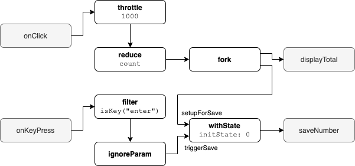

# Linki - Framework-less reactive programming
A simple library that provides utilities to compose your application from function-based components.

Linki's connections could be mapped into a diagram.
It is technically possible to autogenerate diagrams from the code or the code from the diagrams or even visualize a working application to better understand the app and easier debugging.

## No code framework
Linki provides a frame for your application but consists only of typed patterns and small, common utilities function.

It prioritizes simplicity, so you know exactly what you are doing.
As it is extremely simple it is very performant as well, has minimal footprint, easy to learn, maintain and extend.

## Example
A simple component that counts click events, and when the enter key is pressed, it sends the total number to save.

```typescript
export const example: Component<
  { onClick: void; onKeyPress: string },
  { saveNumber: number; displayTotal: number }
  > = ({ saveNumber, displayTotal }) => {
  const [triggerSave, setupForSave] = link(withState(0), saveNumber);

  return {
    onClick: link(
      throttle(1000),
      reduce(count, 0),
      fork(displayTotal, setupForSave)
    ),
    onKeyPress: link(
      filter(isKey("Enter")),
      ignoreParam(),
      triggerSave
    ),
  };
};
```

- throttle - enforces a maximum number of times it passes the event downstream; time in this example no more than once per 1000 milliseconds
- reduce - returns its states on each event. It takes the reducer function. In this example, it just counts the number of incoming events.
- filter - pass only an element that matches the setup predicate. In this example, it only passes keyboard event when the "enter" key was pressed
- ignoreParam - ignores the input data but propagates the signal as an output
- withState - a processor that allows to set up state, on trigger the state is propagated to the output, in this example when enter key is pressed it passes the number of clicks on the output

#### Diagram


## How does it work
The library uses three types of primitives: transformers, processors, and components.
Each primitive type is based on javascript functions, and callbacks and each type get more complex.
The idea is to use the least complex primitive possible to simplify application and avoid overhead.

### Transformers
They are used as the name suggests for data transformation. They can be easily composed using the `pipe` operator.
For an input item, they immediately(synchronously) return the corresponding output item.

Transformers are used to creating data pipelines.

### Processors
Processor is a function that accepts a callback which is its output and returns a callback which is its input.

Processors are used to creating complex data flows.

Having a callback as an argument gives processors the ability to return an item on output regardless of the input.
Processors can: pass some of the items, none of the items, propagate them later, return multiple items, produce new items regardless without receiving anything on input.  
They also can have state and multiple inputs and outputs.

(They are kind of similar to recently popular [transducers](https://raganwald.com/2017/04/30/transducers.html), but simpler)

We have few types of processors.

#### Synchronous processors
The simplest type of processor. It is synchronous and stateless.
For a single input, item processor can
- return a single output item - map
- return or not a single output item - filter
- return multiple output item - expand

#### Asynchronous processors
For each input, returns an output item with some delay.
Could have a second input to signal to cancel of the currently processing operation.

Examples: promise handler, debounce, throttle

#### Stateful processor
On each input item, they modify their internal state, which is pass to the output.

Examples: reduce, state machine

#### Providers
Keep returning elements without requiring any input item. They can have an input to listen to the close signal.

#### Consumers
Do not have any outputs; only consume items.

#### Multi output processors
Propagate input value to a single or all of the outputs.

Examples: switch, select

#### Multi input processors
Combines input events that come from multiple sources and pass the result into a single output.

### Components
Processes can be composed into a black box component. The composing function can have additional logic and accept different parameters so that it could wrap other processors.


Can be used to implement backpressure, lazy loading even separately deployable part of the application.

## How it is different from functional reactive programming libraries
Reactive programming libraries use a stream abstraction with a protocol of communication between nodes.
That protocol allows passing extra information from upstream to downstream, like if a stream has completed or if an error occurred;
and also pass messages from downstream to upstream, like if more data is required.

However, that also introduces some cognitive and computation overhead.
Additionally, that protocol is not trivial to extend, and it is often limited to building pipelines, not networks consisting of nodes with multiple inputs and outputs.

Linki is designed to promote the use of the simples required tool for the task. 
It provides low level functions that do the job well as also more sophisticated patters for more complex cases.

